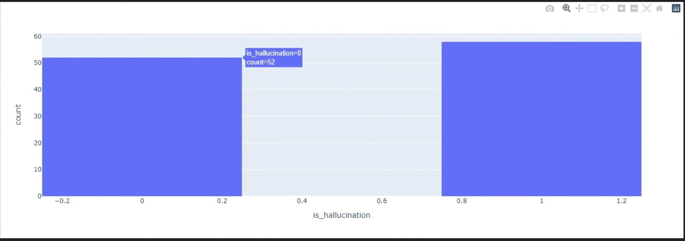

# Назад
[README](readme.md)
# Описание разработки
## Сбор данных
Для того, чтобы исключить возможность корелляции некоторых данных из обучающего датасета, было решено создать отдельный файл для теста. Для сбора данных применялись следующие способы: 
- Использовались различные большие языковые модели, такие как **Reka Core**, **Llama 2 70b**, **GPT4**, **GigaChat** для создания контекста, вопросов и правильных ответов. 
- Для создания галлюциницирующих ответов использовались **Reka Core**, **Llama 2 7b**, **GPT4**, **RuGPT3**.
- Использовались статьи из интернета и википедии, из которых брались фрагменты статьи, по которым вручную строились вопросы, и вручную писались правильные и неправильные ответы. В некоторых случаях для создания ответов использовались большие языковые модели.
В результате получили весьма сбалансированный тест: 52 строк без галлюцинаций, 58 с галлюцинациями.
Код для анализа в файле [Hallucinations_analysis](Hallucinations_analysis.ipynb)

## Методы разработки
Для начала ради эксперимента был опробован метод CatBoost, файл [catboost](deprecated/catboost.ipynb) однако, как и предполагалось, его результаты были весьма скромными: всего 0,60 accuracy, что не сильно лучше простого угадывания. \
Появилась идея использовать сами же большие языковые модели, чтобы LLM анализировала контекст, вопрос и полученный ответ, после чего давала бы вердикт, есть ли галлюцинация в ответе или нет. Для подобной задачи решили применить модель Сайга-Мистраль 7b, которая была дообучена на LLama2. Попытались проверить без дообучения, но модель сама постоянно галлюцинировала. Попробовали дообучить LoRa со следующим форматом:
```
{'system': 'Ты — Сайга, русскоязычный автоматический ассистент. Ты оцениваешь правильный ли ответ на вопрос с учетом контекста, да если ответ правильный и нет если ответ неправильный.',
  'user': 'Херманус Питер (Дик) Логгере (нидерл. Hermanus Pieter (Dick) Loggere, 6 мая 1921, Амстердам, Нидерланды — 30 декабря 2014, Хилверсюм, Нидерланды) — нидерландский хоккеист (хоккей на траве), полузащитник. Бронзовый призёр летних Олимпийских игр 1948 года. \nЗадан вопрос: В каком городе проходил чемпионат мира по хоккею с шайбой в 1936 году? \nОтвет: В Хилверсюме. \nПравильный ли ответ? \n',
  'bot': 'Нет'},
```
Код обучения: [Mistral](deprecated/Mistral_Hallucination.ipynb)
Но в результате обучения метрика была 0.33, что даже хуже, чем с применением catboost. Судя по всему, у такой маленькой модели не хватало знаний, чтобы определить галлюцинацию./
Затем решили применить DeepPavlov/rubert-base-cased. Код: [Bert_hallucination](Bert_hallucination.ipynb). Данный способ показал результат намного лучше: 0.84 после разделения датасета на train И test, и 0.94 на собранном тестовом датасете.
